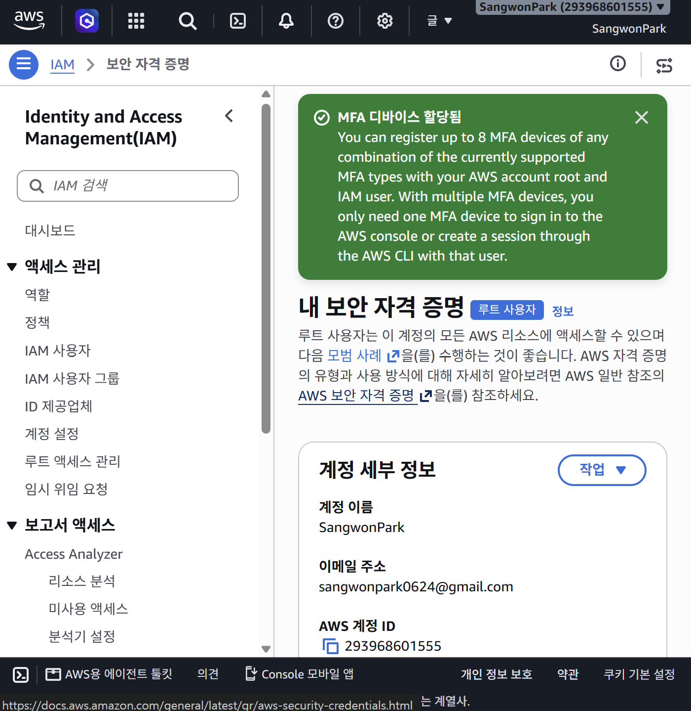
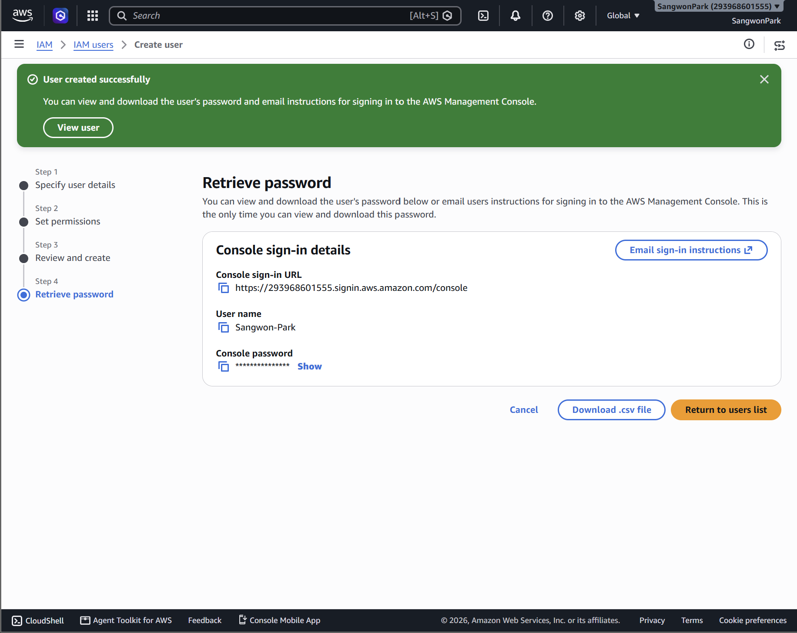
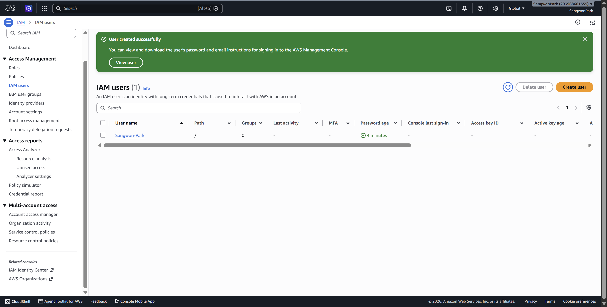
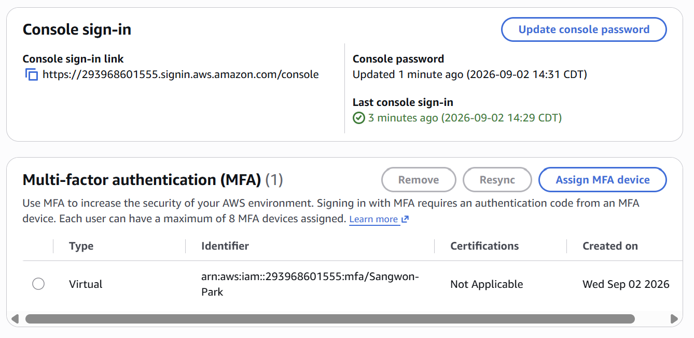

# Lab 01

LAB 1 screenshots

1.

2.

3.

4.

5.
Root user MFA settings serve as the last line of defense for your entire AWS account and are essential for providing strong protection against unauthorized access.
