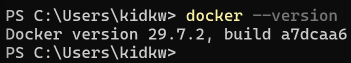
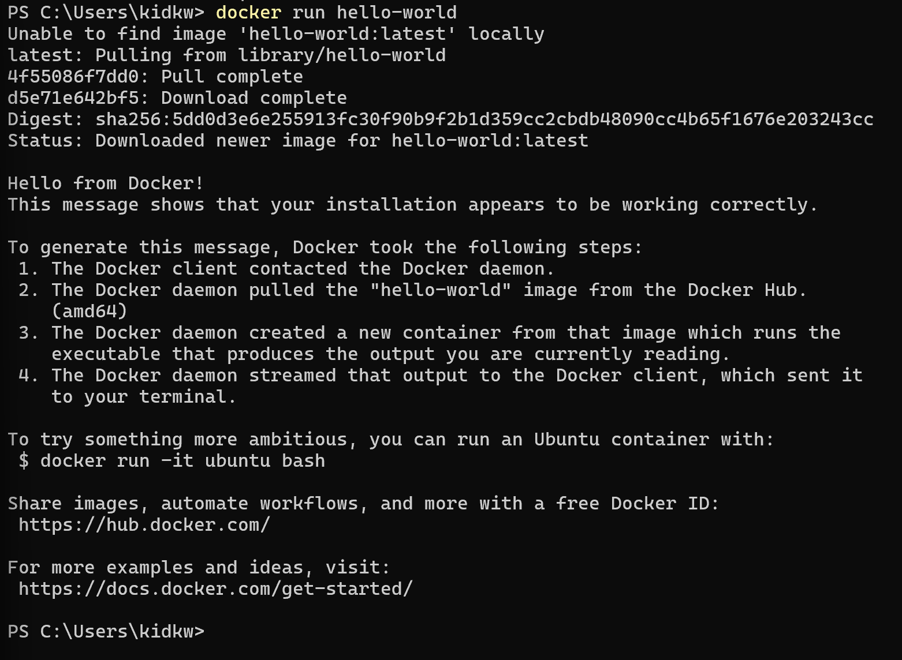
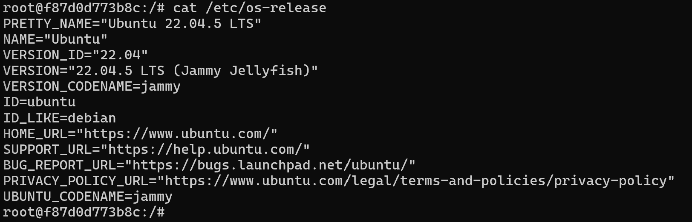
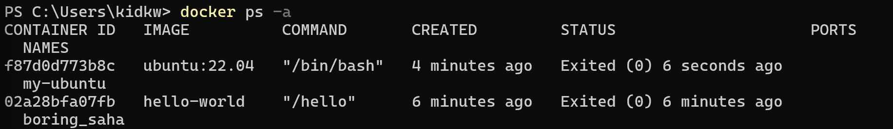
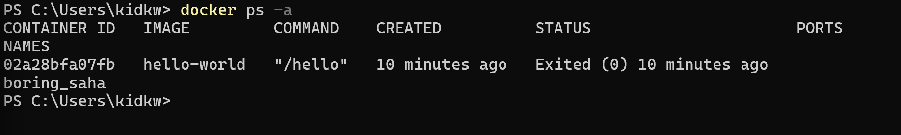

Lab 2

1.

2. 

3. 

4.

5. 

6.
A Docker image is a read only template that contains the files, operating system components, and software needed to create a container. A Docker container is a running or stopped instance created from that image.
