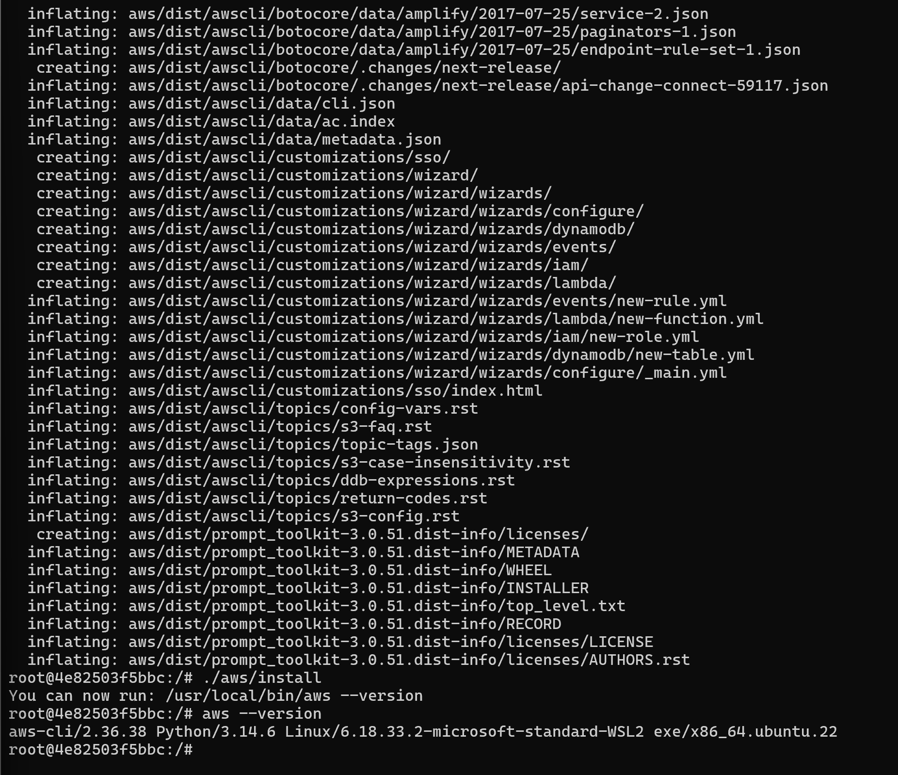
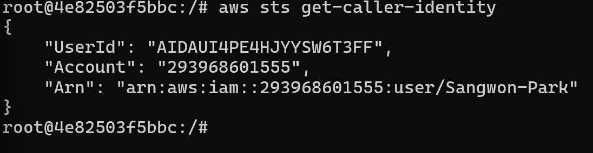
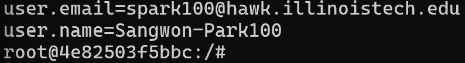
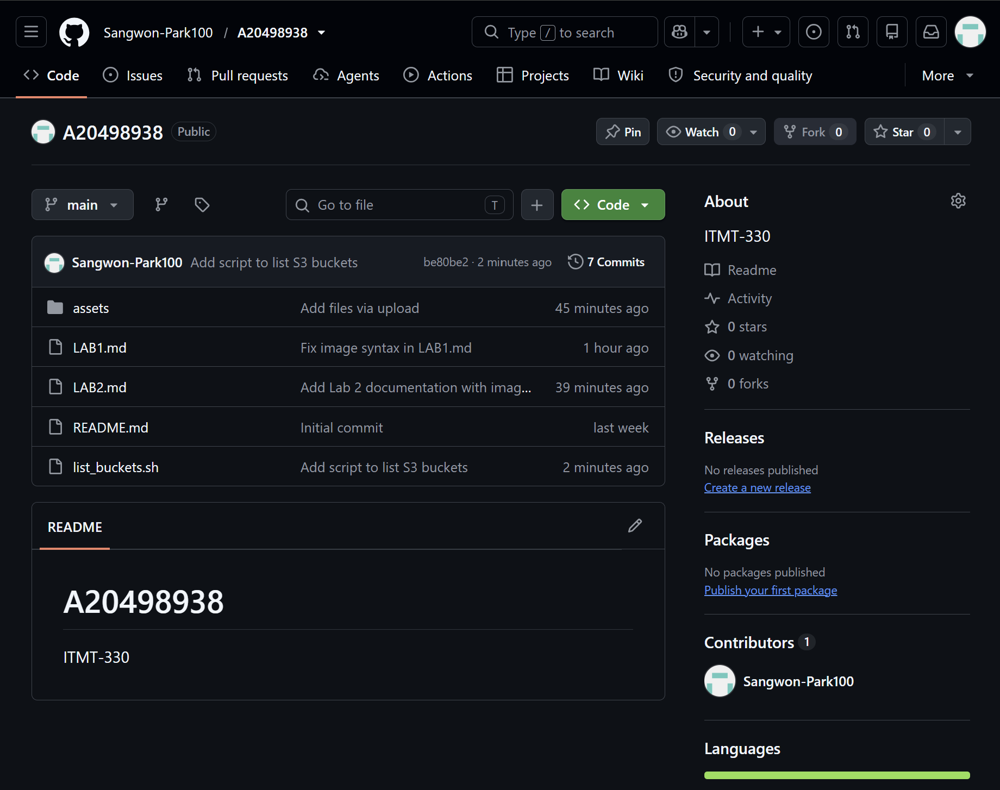

Lab 3

1.

2.

3. 

4.

AWS credentials and GitHub tokens can be used without authorization, so you must never commit them to a repository. Even if the repository is private, they can still be accessed if your credentials are accidentally exposed or your account is hacked.
