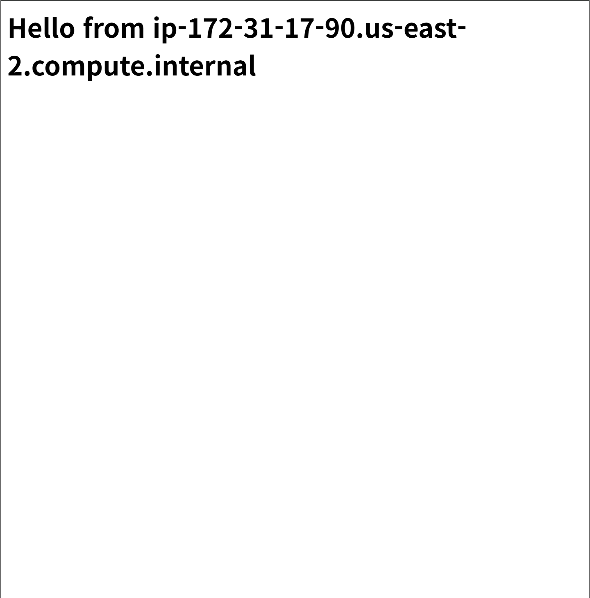
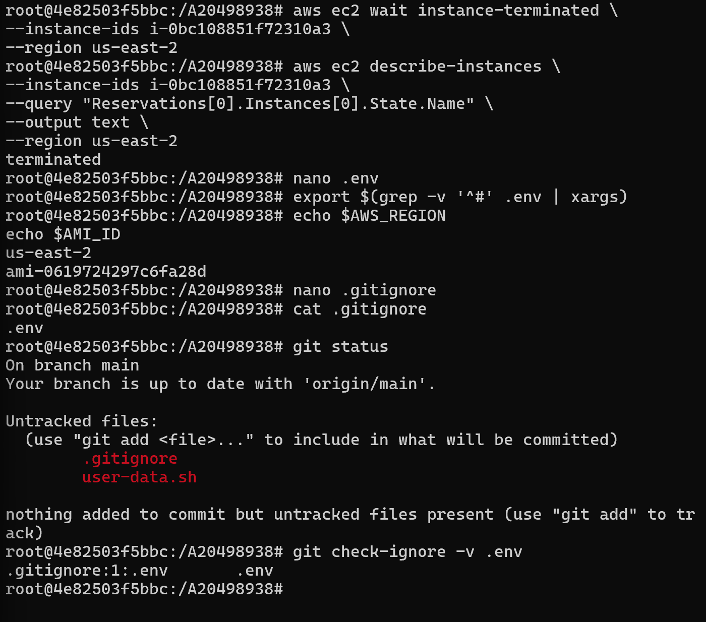
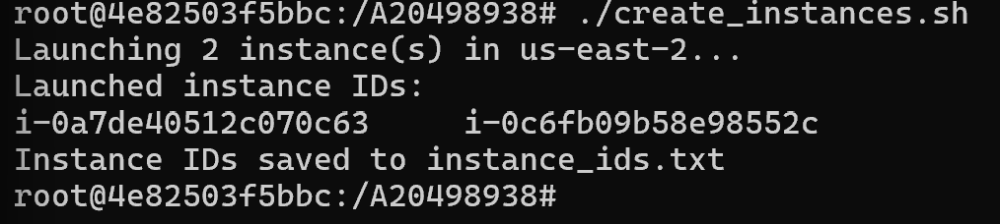
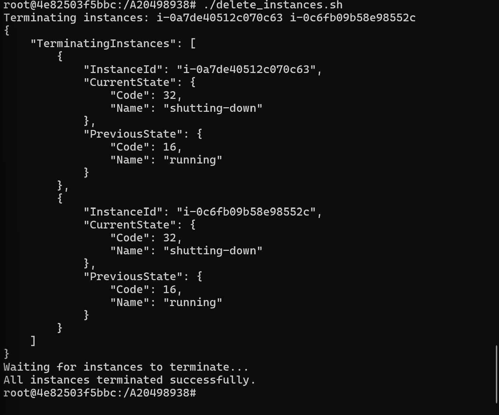
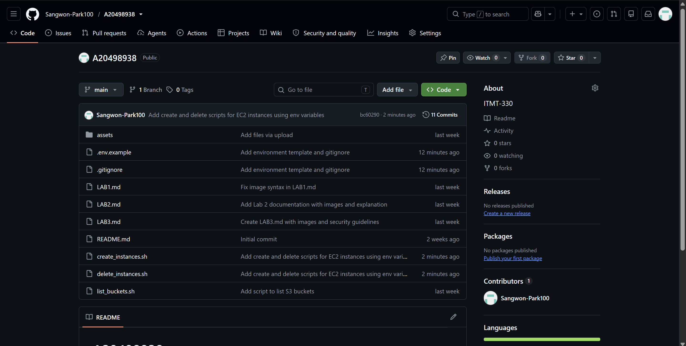
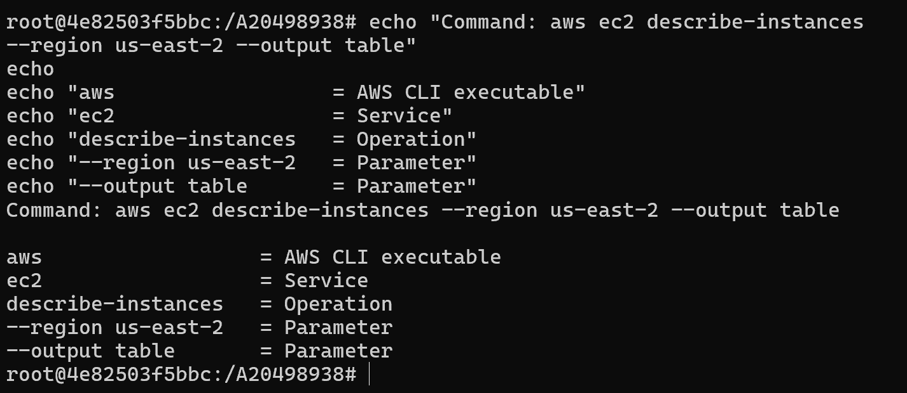

Lab 4

1.

2.

3.

4.

5.

6.

Environment files can contain sensitive information such as API keys, passwords. So user should be get rid of from Git. Even in private repositories, these files can be exposed if accidentally shared or if user account is hacked.
