Lab 5

1.
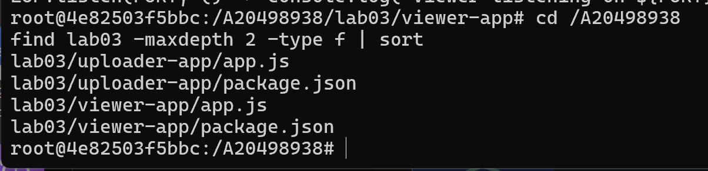

2.
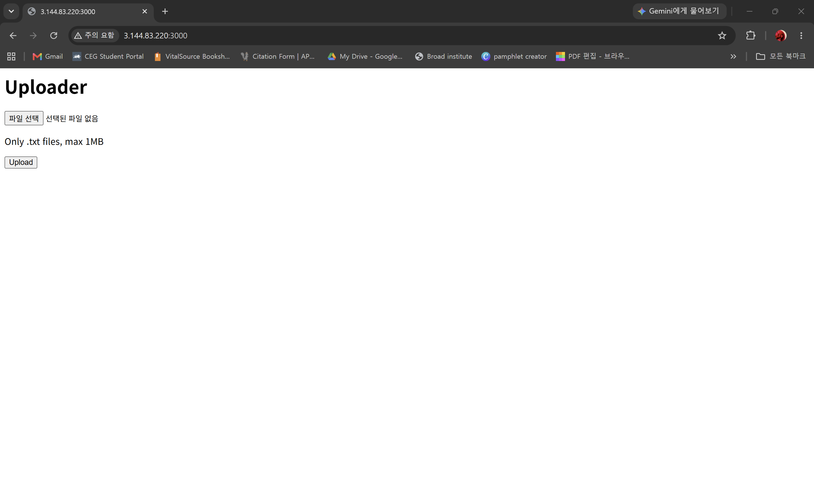

3.
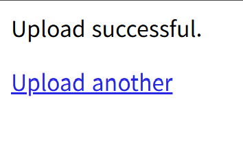

4.
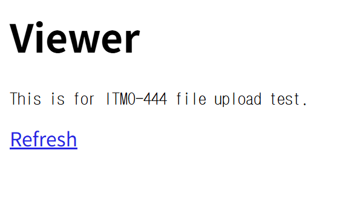

5.
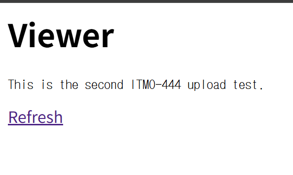

6.
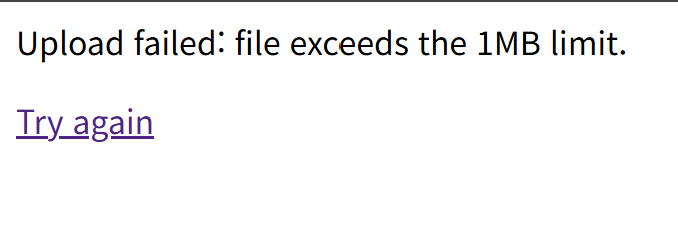

7.
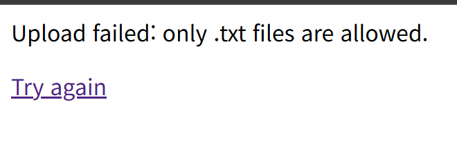

8.
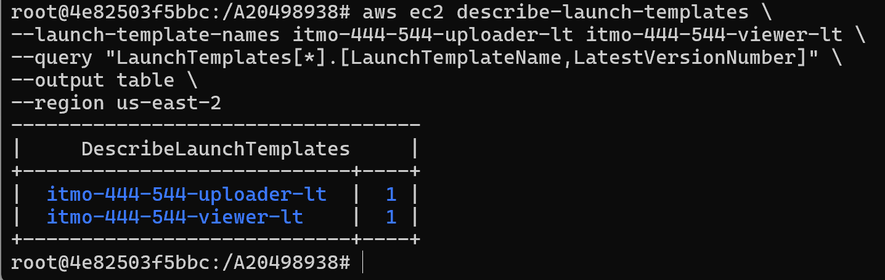

9.
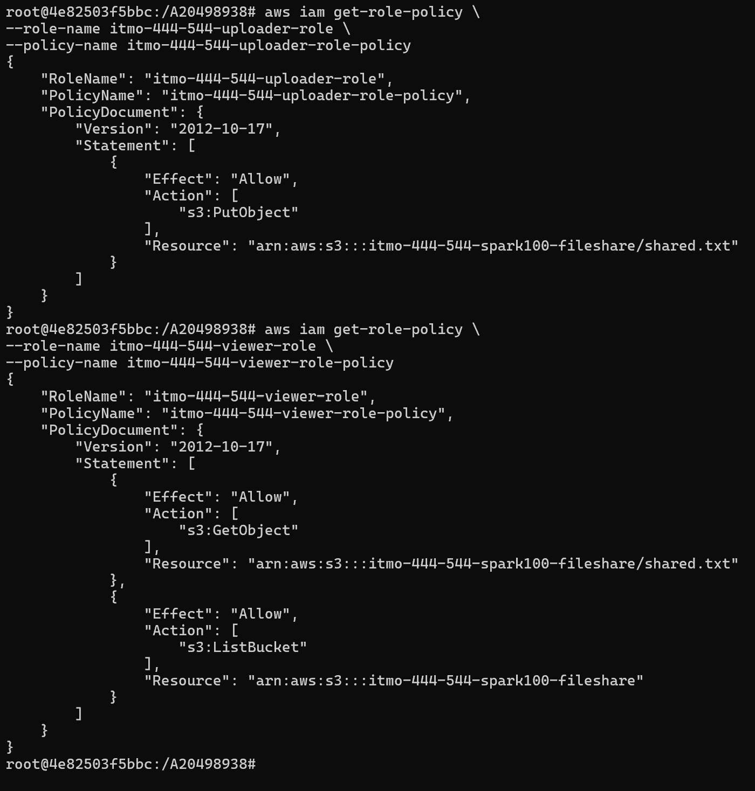

10.
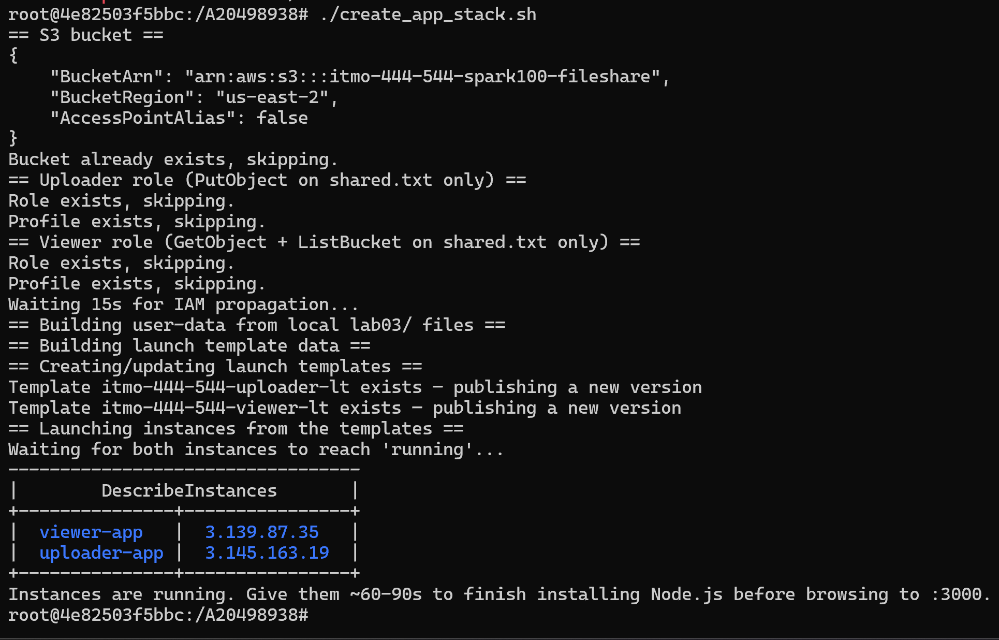

11.
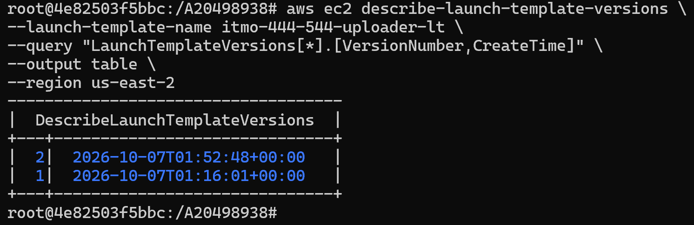

12.
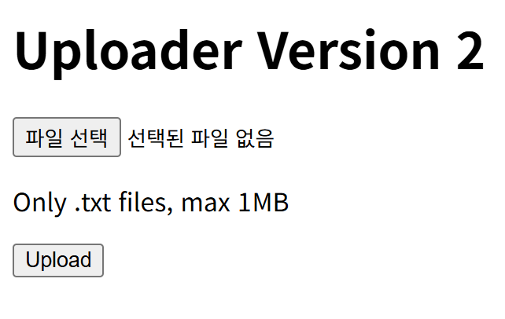

13.
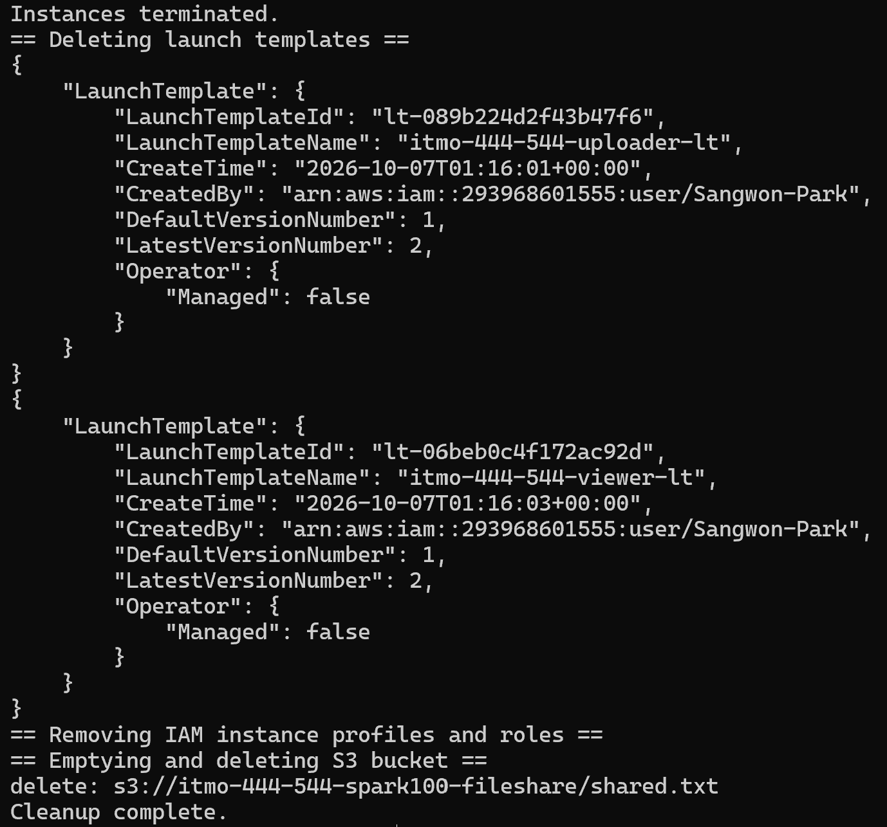

Questions

1. Why the Uploader and Viewer Use Separate IAM Roles?

They use separate IAM roles so each instance only gets the permissions it needs.

2. Why the Application Code Is Embedded in User-Data?

The code is already included in user-data, so the instance does not need Git or S3 credentials to download it.
